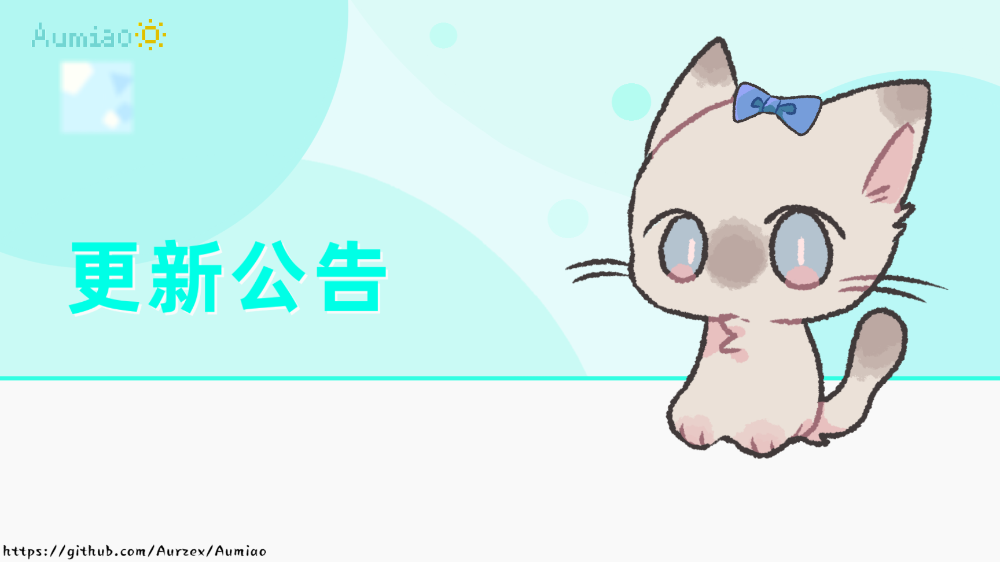
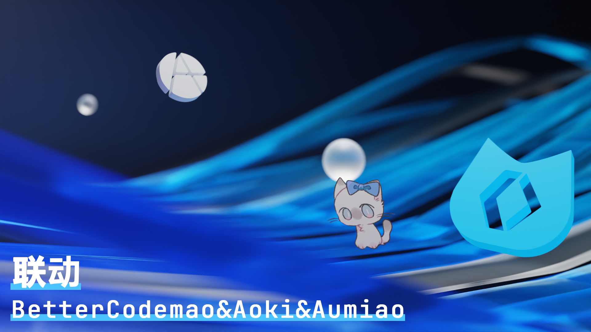

# Aumiao ✨

[](https://github.com/aurzex/)
[](https://github.com/dontLoveby/)
[](https://github.com/MoonLeeeaf/)
[](https://github.com/helloyork/)

[](https://deepwiki.com/Aurzex/Aumiao)

[关注这个仓库谢谢喵](https://github.com/Wangs-official/CodemaoEDUTools)

## 📌 项目简介

**Aumiao** 是一个**社区管理与内容治理平台**，专为编程猫生态系统设计。它不仅是自动化工具，更是一个**可扩展的社区运营框架**，为内容创作者、社区管理员和开发者提供完整的工具链。

> "你说的对，但是《Aumiao》是一款由 Aumiao 开发团队开发的编程猫自动化工具 于 2023 年 5 月 2 日发布，工具以编程猫宇宙为舞台，玩家可以扮演毛毡用户在这个答辩 💩 社区毛线 🧶 坍缩并邂逅各种不同的乐子人 😋。在领悟了《猫站圣经》后，打败强敌扫厕所 😡，在维护编程猫核邪铀删的局面的同时，逐步揭开编程猫社区的真相"

## 🚀 快速开始

### 环境要求

- **Python 3.13** - 主要开发语言和运行环境
- **uv** (0.7.3+) - 现代化的 Python 包管理器和解析器

### 安装方式

#### 方式一：使用 uv（推荐）

```bash
# 克隆项目
git clone https://github.com/aurzex/Aumiao.git
cd Aumiao/Aumiao-py

# 使用 uv 安装依赖
uv sync
```

#### 方式二：传统 pip 安装

```bash
# 克隆项目
git clone https://github.com/aurzex/Aumiao.git
cd Aumiao/Aumiao-py

# 安装依赖
pip install -r requirements.txt
```

## 📦 依赖说明

### 核心依赖

| 包名                   | 版本      | 用途                               |
| ---------------------- | --------- | ---------------------------------- |
| **requests**           | 2.32.3    | HTTP 请求库，用于 API 调用         |
| **websocket-client**   | 1.8.0     | WebSocket 客户端，支持 AI 流式聊天 |
| **certifi**            | 2025.4.26 | SSL 证书验证                       |
| **charset-normalizer** | 3.4.2     | 字符编码检测和转换                 |
| **idna**               | 3.10      | 国际化域名处理                     |
| **urllib3**            | 2.4.0     | HTTP 客户端库                      |

## 🌟 核心特性

### 🛡️ 社区内容治理系统

- **评论审核**：提供完整的评论审核、违规检测、举报处理流程
- **违规识别**：支持广告过滤、黑名单管理、刷屏检测等多种策略
- **内容管理**：批量处理举报、清理违规评论、维护社区秩序

### 🤖 用户交互自动化平台

- **智能回复**：支持关键词匹配和自定义回复模板
- **社交互动**：消息通知管理、红点清除、自动点赞等功能
- **作品管理**：自动回复粉丝、管理作品评论、生成作品口令

### 🔌 开发者扩展框架

- **插件化架构**：通过插件系统扩展功能而无需修改核心代码
- **API 抽象层**：覆盖社区、教育、论坛、工作坊等多个子系统
- **策略模式**：评论处理器支持可插拔的违规检测策略

### 👨‍🏫 教育账号管理工具

- **批量管理**：支持批量创建、删除学生账号
- **教学支持**：生成教师证书、组织教学班级、提升教师权限
- **账号体系**：实现教育场景下的完整账号管理

### 🧠 AI 对话集成

- **流式聊天**：基于 websocket-client 的流式 AI 聊天功能
- **会话管理**：支持多轮对话和会话状态管理

## 🔧 技术架构

### 核心设计模式

- **依赖注入**：通过`Union`类实现统一的依赖容器
- **懒加载模块**：采用 PEP 562 标准，通过`__getattr__()`实现按需导入
- **原子化配置**：JSON 配置文件支持懒加载和原子写入
- **策略模式**：支持动态注册违规检测策略

## 🎯 适用场景

- **社区管理员**：批量处理举报、清理违规评论、维护社区秩序
- **内容创作者**：自动回复粉丝、管理作品评论、生成作品口令
- **教育工作者**：批量管理学生账号、组织教学班级、提升教师权限
- **开发者**：通过插件系统扩展功能、集成第三方服务、自定义业务逻辑

## 📊 项目动态




## ⭐ Star 历史

[](https://star-history.com/#zybqw/Aumiao&Date)

## 🐛 问题反馈

如果您遇到任何问题或有功能建议，请通过以下方式反馈：

1. 在 [GitHub Issues](https://github.com/aurzex/Aumiao/issues) 提交问题
2. 发送邮件至开发团队

## 🤝 贡献指南

我们欢迎社区贡献！请参考以下步骤：

1. Fork 本仓库
2. 创建功能分支 (`git checkout -b feature/AmazingFeature`)
3. 提交更改 (`git commit -m 'Add some AmazingFeature'`)
4. 推送到分支 (`git push origin feature/AmazingFeature`)
5. 开启 Pull Request

## 📮 联系我们

- **官方网站**：[https://aumiao.aurzex.top](https://aumiao.aurzex.top)
- **联系邮箱**：[Aumiao@aurzex.top](mailto:Aumiao@aurzex.top)
- **开发团队**：Aurzex, DontLoveby, Moonleeeaf, Nomen

## 🎉 项目愿景

Aumiao 致力于成为编程猫社区生态的**基础设施层**，为不同角色的用户提供统一的工具平台。通过开放的架构设计和完善的文档支持，降低社区运营和内容管理的技术门槛，让更多人参与到社区建设中来。

## 📄 许可证

本项目采用开源许可证，具体请查看 [LICENSE](LICENSE) 文件。

---

> "感谢您的阅读！😉 一起为编程猫社区建设贡献力量！"
